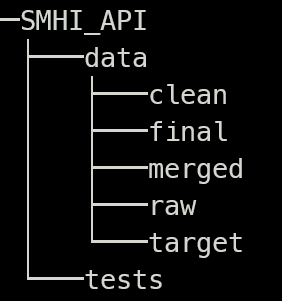

## Handles SMHI api

Small part of a bigger graduation project.  
Only wind average and temperature are supported for now.  

Recomended folder structure:  
  

Other structure should and will throw errors.  
Use at your own risk.  